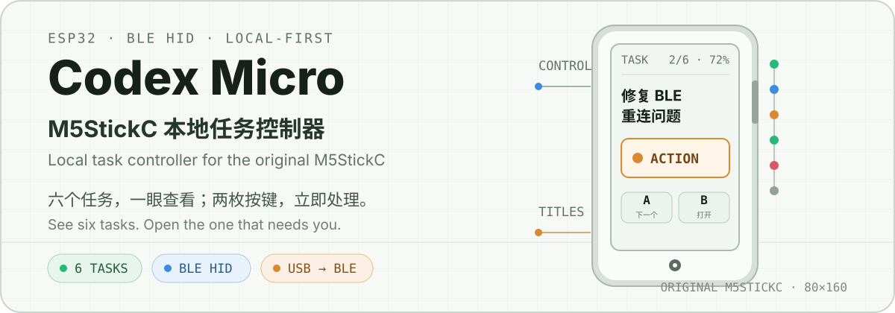
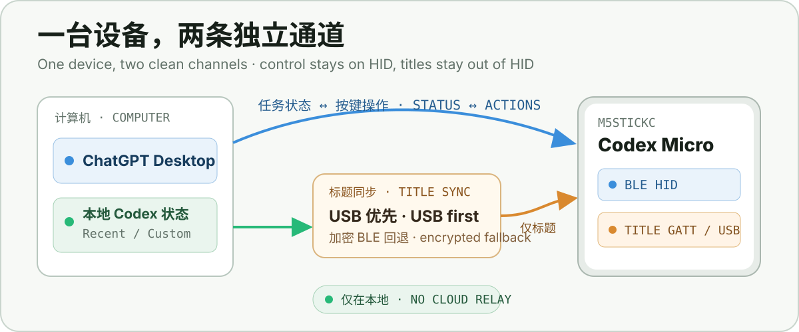

<p align="center">
  
</p>

<p align="center">
  <a href="README.md">简体中文</a>
  ·
  <strong>English</strong>
  ·
  <a href="https://github.com/PolarisLight/codex-micro-stickc/releases">Releases</a>
  ·
  <a href="LICENSE">MIT License</a>
</p>

# Codex Micro for M5StickC

Turn an original **M5StickC** into a pocket-sized Codex task display and physical controller. See six task states at a glance, select a task with the front button, and open it or invoke a mapped action with the top button.

The current source also synchronizes real task titles automatically. It prefers USB while connected and falls back to an independent encrypted BLE channel after the cable is removed. Titles are read and transported locally, without a cloud relay.

> [!WARNING]
> This is an independent compatibility project. It is not affiliated with or supported by OpenAI, Work Louder, or M5Stack. It uses an undocumented device protocol that may change with a future ChatGPT Desktop update.

## Quick start

### 1. Build and flash

Install [PlatformIO](https://platformio.org/), connect the StickC with a data-capable USB-C cable, then run:

```sh
git clone https://github.com/PolarisLight/codex-micro-stickc.git
cd codex-micro-stickc
pio run --target upload
```

The current source contains the automatic USB → BLE title service. If you only need the established base firmware, use the [v0.8.0 release](https://github.com/PolarisLight/codex-micro-stickc/releases/tag/v0.8.0).

### 2. Pair and assign

1. Pair the Bluetooth device named **Codex Micro**.
2. Open **ChatGPT Desktop → Settings → Codex Micro**.
3. Assign tasks to the six Agent Keys.
4. Map command slots to actions such as Approve, Decline, Mic/PTT, Send, Fast, or Fork.

If the host still caches an older HID descriptor, forget **Codex Micro**, restart the StickC, and pair again.

### 3. Enable automatic task titles

Python 3.10+ is required. The same current-user commands work on macOS and Windows without administrator access:

```sh
python tools/title_sync_service.py install
python tools/title_sync_service.py status
```

Remove the service:

```sh
python tools/title_sync_service.py uninstall
```

The installer creates an isolated environment in the user's application-data directory and registers a launchd service on macOS or a Task Scheduler entry on Windows.

## What you get

| Capability | What it does |
| --- | --- |
| **Six live task slots** | Shows Running, Action, Ready, and Error states supplied by the host |
| **Physical control** | Selects and opens tasks, then invokes remappable Codex Micro actions |
| **Automatic titles** | Resolves local assignments and refreshes after changes or restarts |
| **Cable-aware transport** | Prefers USB and falls back to a separate encrypted BLE title channel |
| **Adaptive layout** | Uses the built-in IMU to switch between portrait and landscape UI |
| **Power and battery** | Saves display power without suspending BLE and combines current integration with slow voltage correction |

## How title sync works

<p align="center">
  
</p>

ChatGPT's Codex Micro protocol supplies slot colors and effects, but not task names. The local title service fills that gap:

1. Reads Codex's local assignment state and task database in read-only mode.
2. Follows the default **Recent** source or explicit **Custom** assignments.
3. Detects assignment changes once per second and refreshes unchanged titles every 30 seconds.
4. Writes directly to the StickC over USB serial when available.
5. Falls back to a separate encrypted BLE GATT characteristic after USB disappears.

The title characteristic does not reuse, take ownership of, or write to the vendor HID channel used by ChatGPT. Logs redact task names by default and do not print Bluetooth identifiers.

Every boot begins with `AGENT N`. Real titles appear only after the first valid title packet, preventing stale cached names from being displayed.

> [!NOTE]
> **Recent** and **Custom** are supported. **Pinned** and **Priority** are not yet mirrored. Automatic BLE fallback is validated on macOS; Windows is validated over USB, while its BLE path still needs testing.

## Controls

| Input | Tasks page | Commands page |
| --- | --- | --- |
| Front **A**, short press | Select next task | Select next command |
| Front **A**, hold | Switch to Commands | Switch to Tasks |
| Top-right **B**, press/release | Open selected task | Run selected command |
| Side power button, short press | Wake or turn off display | Wake or turn off display |
| Rotate device | Switch orientation | Switch orientation |

While the display is asleep, the first A/B press only wakes it. Press again to perform the action, preventing accidental changes during wake-up.

### Status colors

| Color | Approximate meaning |
| --- | --- |
| Blue | Running |
| Orange | Action or approval required |
| Green | Ready or completed |
| Red | Error |
| Empty slot | No task assigned |

Exact colors and effects are supplied by ChatGPT Desktop and may change between versions.

## Power and battery

To preserve the active Codex Micro connection, the firmware does not put the ESP32 or BLE controller into light or deep sleep. Power is saved at the display level instead:

| Power source | Display behavior |
| --- | --- |
| Battery | Dim after 20 seconds; off after 60 seconds |
| USB/VBUS | Dim after 120 seconds; remain on |

Battery percentage no longer comes directly from noisy instantaneous voltage. The estimator integrates charge and discharge current against the original 95 mAh cell, uses smoothed load-compensated voltage only for slow correction, and persists its result across restarts.

The first boot still starts from a voltage estimate. Accuracy improves after a full charge and normal discharge cycle. This remains a software estimate, not a dedicated fuel gauge.

## Build and diagnostics

### Requirements

- Original M5StickC (ESP32-PICO-D4, 80 × 160 display)
- Data-capable USB-C cable
- Windows or macOS with ChatGPT Desktop and Codex Micro support
- [PlatformIO](https://platformio.org/) and Python 3.10+

```sh
pio run
pio run --target upload
pio device monitor
python -m unittest discover -s tests -v
```

The serial monitor runs at `115200` baud and a successful boot prints `CODEX_MICRO_READY`. If automatic upload reset is unreliable, use esptool at `115200` baud to flash the application image at address `0x10000`.

### Manual title-sync diagnostics

The background service is recommended for daily use. These foreground commands help diagnose discovery or Bluetooth permissions:

```sh
python -m pip install pyserial bleak==3.0.2
python tools/sync_titles_auto.py --once
python tools/sync_titles_usb.py
python tools/sync_titles_ble.py --once
```

Use `python tools/sync_titles_usb.py --show-titles` only when task names are explicitly needed in foreground debug output. Specify `--port COM3` or `--port /dev/cu.usbserial-*` only when automatic discovery cannot choose between multiple serial devices.

On macOS, the service runtime may request permission under **System Settings → Privacy & Security → Bluetooth**. If an older pairing cannot see the new title service, forget **Codex Micro**, restart the StickC, and pair again.

## Compatibility

| Area | macOS | Windows |
| --- | :---: | :---: |
| Codex Micro BLE HID | Tested | Tested |
| USB title sync | Tested | Tested |
| Background service | launchd | Task Scheduler |
| Automatic BLE title fallback | Tested | Not yet validated |

## Current limitations

- Only the original M5StickC is currently validated; Plus variants may require display and pin changes.
- The built-in microphone is not streamed to the computer; Mic/PTT still activates the host microphone.
- The original StickC battery is very small, so runtime remains limited while maintaining active BLE.
- The vendor protocol is undocumented and may break after a ChatGPT Desktop update.
- BLE reliability depends on battery condition, power path, host radio, and cached pairing state. Keep a known-good release image for recovery.

<details>
<summary><strong>Project layout</strong></summary>

```text
include/BatteryEstimator.h   Hybrid battery state-of-charge estimator
include/CodexMicroBle.h      BLE transport and shared state
src/CodexMicroBle.cpp        HID, RPC framing, and encrypted title GATT service
src/main_stickc.cpp          UI, controls, IMU, title sync, and power behavior
tools/sync_titles_auto.py    Automatic USB-to-BLE title synchronizer
tools/sync_titles_ble.py     One-shot BLE title synchronizer
tools/sync_titles_usb.py     Local assignment and title reader
tools/title_sync_service.py  macOS/Windows background service manager
platformio.ini               Reproducible PlatformIO build
```

</details>

## Credits

This port is derived from [`imliubo/codex-micro-4-core2`](https://github.com/imliubo/codex-micro-4-core2), which provided the original BLE HID and Codex Micro protocol implementation. The original copyright and MIT license are preserved.

## License

MIT. See [LICENSE](LICENSE) and [NOTICE.md](NOTICE.md).
